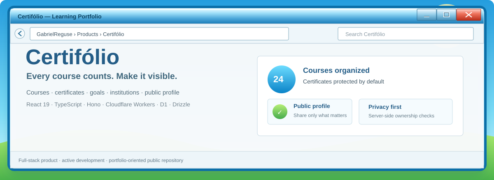

<p align="center">
  
</p>

<p align="center">
  <a href="./ARQUITETURA.md">Architecture</a>
  &nbsp;&nbsp;·&nbsp;&nbsp;
  <a href="./CONFIGURACAO.md">Setup</a>
  &nbsp;&nbsp;·&nbsp;&nbsp;
  <a href="./SECURITY.md">Security</a>
  &nbsp;&nbsp;·&nbsp;&nbsp;
  <a href="./CHANGELOG.md">Changelog</a>
</p>

<br>

## Por que isso existe

Certificados costumam terminar espalhados entre pastas, e-mails, plataformas de curso e links que ninguém lembra onde salvou.

O **Certifólio** é a minha tentativa de transformar essa bagunça em uma trajetória de aprendizagem que seja fácil de organizar, privada quando precisa ser e apresentável quando vale a pena mostrar.

Não é só um catálogo de certificados. O produto conecta **cursos, instituições, tecnologias, metas e perfil público** em uma experiência única.

<br>

## O produto em 30 segundos

<table>
<tr>
<td width="50%" valign="top">

### Organizar

Cadastro, edição, busca e agrupamento de cursos por instituição, sem depender de pastas montadas manualmente.

</td>
<td width="50%" valign="top">

### Proteger

Certificados e dados sensíveis ficam privados por padrão, com validação e autorização também no servidor.

</td>
</tr>
<tr>
<td width="50%" valign="top">

### Mostrar

Perfil público compartilhável para transformar cursos concluídos em uma trajetória profissional legível.

</td>
<td width="50%" valign="top">

### Continuar

Metas de aprendizagem ajudam a registrar o que vem depois, em vez de tratar formação como uma lista encerrada.

</td>
</tr>
</table>

<br>

## Stack

| Camada | Tecnologia |
| --- | --- |
| Interface | React 19 · TypeScript · Vite |
| API | Hono · Cloudflare Workers |
| Dados | Cloudflare D1 · Drizzle ORM |
| Auth | Better Auth |
| Validação | Zod |
| Arquivos | Cloudinary |
| Integrações | Resend · Google OAuth · Turnstile |

<br>

## Como as peças se encaixam

```text
browser
   │
   ▼
React + TypeScript
   │
   ▼
Cloudflare Worker + Hono
   ├── auth + authorization
   ├── validation + business rules
   ├── D1 + Drizzle
   └── protected media access
```

A interface **não é tratada como fronteira de segurança**. Operações sensíveis são validadas novamente no servidor antes de acessar dados ou arquivos.

A visão mais completa está em [`ARQUITETURA.md`](./ARQUITETURA.md).

<br>

## Princípios do produto

**Privado por padrão.** O usuário escolhe o que aparece publicamente.  
**Organização sem atrito.** A estrutura deve trabalhar pelo usuário, não o contrário.  
**Apresentação de verdade.** O perfil público precisa ser útil para recrutadores, escolas e clientes.  
**Responsivo por definição.** A experiência não pode depender de um único tamanho de tela.  
**Segurança no servidor.** Regra importante não pode existir só no front-end.

<br>

## Rodando localmente

A configuração completa de ambiente, banco, Cloudflare e integrações está documentada em [`CONFIGURACAO.md`](./CONFIGURACAO.md).

O repositório também mantém migrações versionadas, scripts de validação e documentação separada para arquitetura, segurança e histórico de mudanças.

<br>

## Estado

O Certifólio está em **desenvolvimento ativo**. Fluxos, arquitetura e decisões visuais ainda podem evoluir conforme o produto é testado e refinado.

<br>

## Segurança e uso do código

Relatos de vulnerabilidade devem seguir [`SECURITY.md`](./SECURITY.md) e, quando necessário, usar um **GitHub Security Advisory privado**.

Este repositório é público para **visualização, avaliação técnica e portfólio**. Ele não concede licença open source. Consulte [`LICENSE`](./LICENSE) para os termos completos de uso e copyright.

---

<p align="center">
  <b>Organize o que você aprendeu. Apresente o que você sabe.</b><br>
  <sub>© 2026 Gabriel Reguse da Silva</sub>
</p>